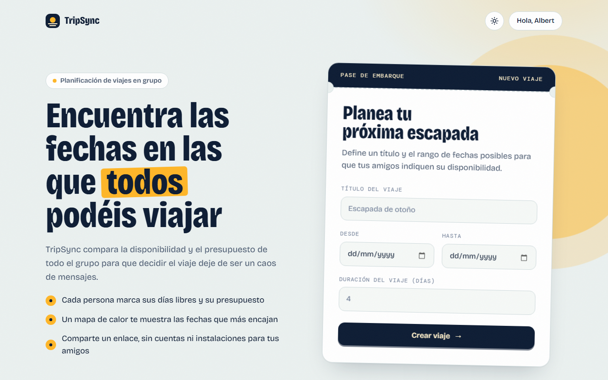
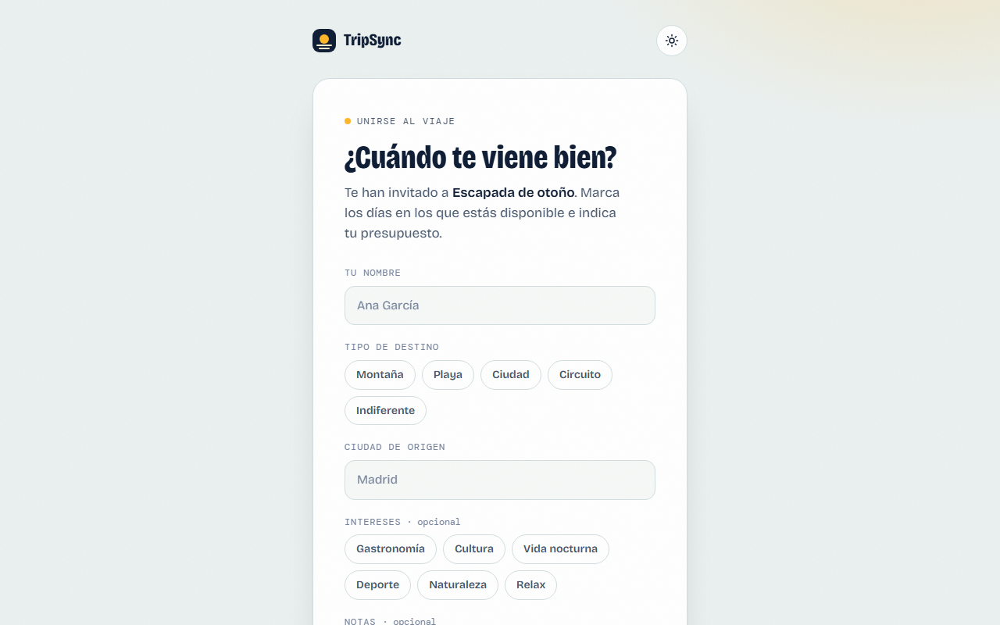
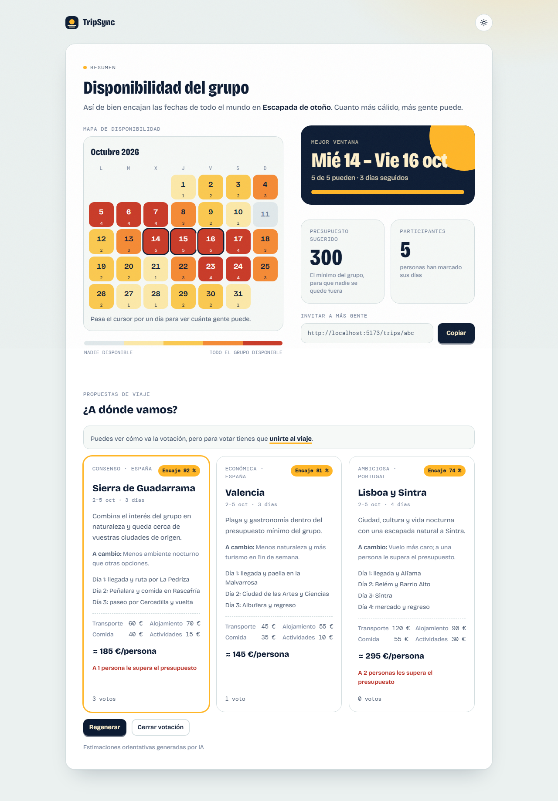
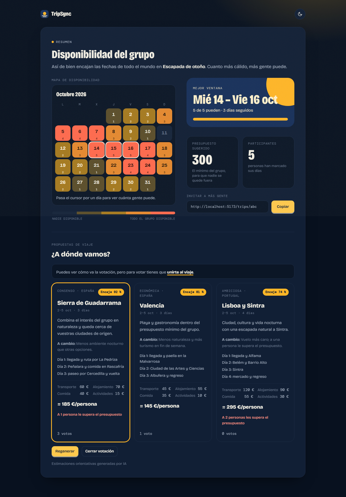

# TripSync

> Plan group trips without the chat chaos: everyone marks their free days and budget, TripSync finds the dates that work for the most people, proposes three destinations with an LLM, lets the group vote, and builds the itinerary and a shared checklist. No account needed to join.

🌐 **[trip-sync-app-theta.vercel.app](https://trip-sync-app-theta.vercel.app)** · [Repository](https://github.com/albertsp/trip-sync)

[](https://trip-sync-app-theta.vercel.app)
[](LICENSE)
[](https://github.com/albertsp/trip-sync/actions/workflows/ci.yml)
[](https://openjdk.org)
[](https://spring.io/projects/spring-boot)
[](https://react.dev)
[](https://www.typescriptlang.org)
[](https://postgresql.org)
[](https://tailwindcss.com)

<p align="center">
  
</p>

---

## Table of contents

- [Why this exists](#why-this-exists)
- [Features](#features)
- [How it works](#how-it-works)
- [Tech stack](#tech-stack)
- [Architecture](#architecture)
- [Getting started](#getting-started)
- [Environment variables](#environment-variables)
- [API overview](#api-overview)
- [Testing and CI](#testing-and-ci)
- [Project structure](#project-structure)
- [Deployment](#deployment)
- [Technical decisions](#technical-decisions)
- [Challenges and lessons learned](#challenges-and-lessons-learned)
- [Troubleshooting](#troubleshooting)
- [Roadmap](#roadmap)
- [Contributing](#contributing)
- [License](#license)

---

## Why this exists

Organizing a group trip usually means a chat thread where ten people argue about dates and nobody wants to admit their real budget. I wanted a tool that turns "when can everyone go" into a single visual, a calendar where the darkest days are the ones with the most availability, without forcing every participant to create an account just to answer two questions.

**TripSync** lets one person create a trip and share a link. Everyone else opens it, marks their free days and budget, and the group sees the best dates at a glance. The interface is in Spanish.

---

## Features

|                                                                                                                      |                                                                                                                           |
| -------------------------------------------------------------------------------------------------------------------- | ------------------------------------------------------------------------------------------------------------------------- |
|  |  |

- **Availability heatmap**: the more people are free on a day, the warmer the cell. Hover a day to see how many can go.
- **Best window**: the stretch of consecutive days that fits the most people for the trip duration, highlighted on the calendar.
- **Custom calendar**: click, drag across days or use the keyboard (arrow keys + space) to mark your free days. Touch-friendly, with `aria-pressed` states for screen readers.
- **Shared budget**: the minimum budget of the group, so nobody is left out.
- **No account to join**: only the creator signs in (Google). Participants just need the link.
- **Trip preferences**: destination type, interests, origin city and notes, collected when joining.
- **AI trip proposals and voting**: once at least three people have shared their preferences, the creator generates three destination proposals with cost breakdown. Each participant votes once (identified by their edit token); the creator closes the vote, and picks the winner if there is a tie.
- **Itinerary and shared checklist**: for the winning proposal, the creator generates a day-by-day itinerary and seeds a checklist that participants can extend, claim and tick off.
- **Anonymous by design**: the model only receives an anonymous group snapshot (no names, emails or ids); the best dates and the budget figures are computed in code, not by the model.
- **Capped AI usage**: per-trip and daily generation limits, a cooldown between generations, and a minimum number of participants.
- **AI trip proposals and voting**: the creator generates three destination proposals (consensus, budget and ambitious) with cost breakdown, fit score and who goes over budget. Each participant casts one vote, changeable until the creator closes it; a tie needs the creator's choice.
- **Itinerary and shared checklist**: once the winner is confirmed, the creator builds the trip: a day-by-day itinerary with tips and a checklist where anyone who joined can claim, tick and add tasks.
- **Light and dark themes** with a "Golden Hour" visual identity.

<p align="center">
  
</p>

---

## How it works

1. A user signs in with Google and creates a trip with a title, a range of possible dates and a preferred duration.
2. They share the generated link with the group.
3. Anyone who opens the link marks their available dates, budget and preferences, no account required.
4. The summary page shows the heatmap, the best window and the group's minimum shared budget.
5. With three or more participants, the creator generates three destination proposals; everyone votes with their personal link.
6. The creator closes the vote (and breaks any tie) to confirm the winning destination.
7. The creator generates the itinerary, and the group shares a checklist with claimable tasks.
8. When enough people have joined (3 by default), the creator generates three proposals. The code fixes the dates, currency and cost totals; the model only chooses destinations and writes the plan.
9. Participants vote. The creator closes the vote (and breaks a tie if needed) to confirm the winner.
10. The creator builds the trip: a second model call details the winner day by day and seeds the checklist.

The model output is never trusted: it is read with strict JSON parsing, cleaned of links and markup, validated with Bean Validation and business rules (three distinct destinations, the right number of days, the group currency) and retried once with the error before answering `502`. See [AI proposals](#ai-proposals).

---

## Tech stack

| Layer      | Technology                                                                                             |
| ---------- | ------------------------------------------------------------------------------------------------------ |
| Frontend   | React 19 + TypeScript 5 + Vite 7                                                                       |
| Styling    | Tailwind CSS v4 + custom design tokens                                                                 |
| Routing    | React Router 7                                                                                         |
| Animations | Motion                                                                                                 |
| Backend    | Spring Boot 4 (Java 21): Web, Data JPA, Validation, Security, OAuth2 Client                            |
| Database   | PostgreSQL 16                                                                                          |
| Auth       | Google OAuth2 + cookie sessions + CSRF protection                                                      |
| Testing    | Vitest (unit), Playwright (E2E), JUnit 5 + Mockito + MockMvc on in-memory H2 (backend)                 |
| CI         | GitHub Actions                                                                                         |
| Deployment | Vercel (frontend) + Fly.io (backend)                                                                   |
| AI         | Provider-agnostic LLM client (OpenAI-compatible API, Mistral by default) with strict output validation |

---

## Architecture

```
┌──────────────────┐  /backend/* proxy   ┌──────────────────┐     ┌────────────┐
│  React SPA       │ ──────────────────▶ │  Spring Boot API │ ──▶ │ PostgreSQL │
│  (Vercel)        │ ◀────────────────── │  (Fly.io)        │     └────────────┘
└──────────────────┘   first-party       └────────┬─────────┘
                       cookies                    │
                                          ┌───────▼────────┐
                                          │ Google OAuth2  │
                                          └────────────────┘
```

1. The schema is created and extended by Hibernate (`ddl-auto: update`), so a deploy adds the new tables and columns on its own; new numeric columns carry a database default so they can be added to tables that already have rows.

The browser only ever talks to the Vercel domain. A rewrite (`/backend/*` → Fly.io) proxies API calls, so the session and CSRF cookies are first-party. 2. Authentication uses Google OAuth2 through Spring Security, with a cookie-based session and CSRF protection (`XSRF-TOKEN`) on state-changing requests. 3. Two kinds of caller: the **creator** acts with the Google session (create the trip, generate proposals, confirm, plan) and every one of those requests is CSRF-protected. **Participants** need no account: joining is public, and voting and checklist actions use their personal `X-Edit-Token` header. 4. The AI layer sits behind an `LlmClient` interface (OpenAI-compatible, fake for tests and E2E, disabled when no API key is set). `StructuredLlmService` parses the JSON and validates it against a schema and Bean Validation before anything is used.

---

## Getting started

### Prerequisites

- Java 21
- Node.js 22 (see `frontend/.nvmrc`; with nvm or fnm, run `nvm use` inside `frontend/`)
- Docker (for the local PostgreSQL database)
- Google OAuth2 credentials from the [Google Cloud Console](https://console.cloud.google.com/apis/credentials), with:
  - Authorized origin: `http://localhost:5173`
  - Redirect URI: `http://localhost:8080/login/oauth2/code/google`

### Setup

```bash
git clone https://github.com/albertsp/trip-sync.git
cd trip-sync

# Database (PostgreSQL on localhost:5432, database `tripsync_data`)
docker compose up -d

# Frontend
cd frontend
npm install
cp .env.example .env            # API and app base URLs for local development
```

### Run the project

```bash
# Terminal 1: backend
cd backend
export GOOGLE_CLIENT_ID=your_client_id          # Windows PowerShell: $env:GOOGLE_CLIENT_ID="..."
export GOOGLE_CLIENT_SECRET=your_client_secret
./mvnw spring-boot:run                          # http://localhost:8080

# Terminal 2: frontend
cd frontend && npm run dev                      # http://localhost:5173
```

The database container started in the setup step keeps running in the background. `backend/.env.example` lists every variable the backend reads.

---

## Environment variables

**Backend** (see `backend/.env.example`)

| Variable                                                             | Required        | Description                                                                                            |
| -------------------------------------------------------------------- | --------------- | ------------------------------------------------------------------------------------------------------ |
| `GOOGLE_CLIENT_ID` / `GOOGLE_CLIENT_SECRET`                          | Yes             | Google OAuth2 credentials. The app refuses to start without them.                                      |
| `LLM_API_KEY`                                                        | For AI features | API key of the OpenAI-compatible provider. Without it the AI endpoints are disabled.                   |
| `LLM_PROVIDER`                                                       | No              | `openai-compatible` (default) or `fake` (canned output, dev/E2E only).                                 |
| `LLM_BASE_URL` / `LLM_MODEL`                                         | No              | Provider URL and model. Defaults: `https://api.mistral.ai/v1` and `mistral-small-latest`.              |
| `LLM_MAX_OUTPUT_TOKENS` / `LLM_TIMEOUT_MS`                           | No              | Output cap (default 8192) and request timeout (default 45000).                                         |
| `LLM_MAX_GENERATIONS_PER_TRIP` / `LLM_MAX_PLAN_GENERATIONS_PER_TRIP` | No              | Proposal generations (default 3) and itinerary generations (default 2) per trip.                       |
| `LLM_COOLDOWN_SECONDS` / `LLM_MAX_GENERATIONS_PER_DAY`               | No              | Wait between generations (default 60) and global daily cap (default 50).                               |
| `LLM_MIN_PARTICIPANTS`                                               | No              | Participants with preferences needed before generating (default 3).                                    |
| `DATABASE_URL`                                                       | No locally      | JDBC URL. Defaults to `jdbc:postgresql://localhost:5432/tripsync_data`, matching `docker-compose.yml`. |
| `DATABASE_USERNAME` / `DATABASE_PASSWORD`                            | No locally      | Database credentials. Defaults match `docker-compose.yml`.                                             |
| `FRONTEND_URL`                                                       | No locally      | Where the user lands after login. Default `http://localhost:5173`.                                     |
| `CORS_ALLOWED_ORIGINS`                                               | No locally      | Allowed frontend origins. Default `http://localhost:5173`.                                             |
| `OAUTH2_REDIRECT_URI`                                                | Production      | Public redirect URI registered in Google, e.g. `https://<frontend>/backend/login/oauth2/code/google`.  |
| `COOKIE_SAME_SITE` / `COOKIE_SECURE`                                 | Production      | Session cookie flags. `Lax` / `false` locally.                                                         |
| `SPRING_PROFILES_ACTIVE`                                             | Production      | Set to `prod` to disable the test-only seed endpoint.                                                  |

> The model receives an anonymous snapshot: no names, emails or ids. Origin city and free-text notes are sent, so use fictional data on free-tier providers.

**Frontend** (see `frontend/.env.example`)

| Variable            | Description                                                                         |
| ------------------- | ----------------------------------------------------------------------------------- |
| `VITE_API_BASE_URL` | Base URL of the backend. `http://localhost:8080` locally, `/backend` in production. |
| `VITE_APP_BASE_URL` | Public URL of the app, used to build share links.                                   |

> Never commit real secrets. Use the `.env.example` files as templates and keep `.env` files out of git.

### AI proposals

Generation uses any OpenAI-compatible `/chat/completions` API with JSON-schema structured outputs (Mistral, Groq, Cerebras, OpenRouter): only the variables below change.

| Variable                            | Default                     | Description                                                                                         |
| ----------------------------------- | --------------------------- | --------------------------------------------------------------------------------------------------- |
| `LLM_API_KEY`                       | empty                       | Provider key. **Without it generation is disabled** (`503`) and the rest of the app works normally. |
| `LLM_PROVIDER`                      | `openai-compatible`         | Use `fake` for canned proposals in development and tests.                                           |
| `LLM_BASE_URL`                      | `https://api.mistral.ai/v1` | Provider base URL.                                                                                  |
| `LLM_MODEL`                         | `ministral-14b-latest`      | Chosen after benchmarking the models available on a free Mistral account.                           |
| `LLM_TIMEOUT_MS`                    | `60000`                     | Read timeout per call. A call usually takes 7-25 s.                                                 |
| `LLM_MAX_GENERATIONS_PER_TRIP`      | `3`                         | Proposal generations per trip.                                                                      |
| `LLM_MAX_PLAN_GENERATIONS_PER_TRIP` | `2`                         | Itinerary generations per trip.                                                                     |
| `LLM_COOLDOWN_SECONDS`              | `60`                        | Wait between generations of the same trip.                                                          |
| `LLM_MAX_GENERATIONS_PER_DAY`       | `50`                        | Global daily cap on model calls (proposals and plans).                                              |
| `LLM_MIN_PARTICIPANTS`              | `3`                         | Participants with preferences needed to generate.                                                   |

Things worth knowing:

- Generating again with the same inputs returns the existing proposals and costs nothing.
- Participant data is sent to the model **without names or emails**, one anonymous row each, and free text is delimited as data. See the in-app privacy page (`/privacidad`).
- Mistral's free plan may train on what it receives: use fictional data while developing. Rate limits are set per model, so a key can chat with one model and get `429` on another.
- `RealProviderSmokeTest` is a manual benchmark against the real provider (skipped without `LLM_API_KEY`): `set -a; source backend/.env.local; set +a; cd backend && ./mvnw test -Dtest=RealProviderSmokeTest`.

---

## API overview

| Method         | Endpoint                     | Description                                                            | Auth                   |
| -------------- | ---------------------------- | ---------------------------------------------------------------------- | ---------------------- |
| `POST`         | `/trips`                     | Create a trip                                                          | Google session         |
| `GET`          | `/trips/{id}`                | Get a trip's data                                                      | Public (link)          |
| `POST`         | `/trips/{id}/participants`   | Join with dates, budget and preferences                                | Public (link)          |
| `GET`          | `/trips/{id}/summary`        | Availability per day, participant count and group budget               | Public (link)          |
| `GET`          | `/trips/{id}/proposals`      | Latest generation with votes (and your own vote with `X-Edit-Token`)   | Public (link)          |
| `POST`         | `/trips/{id}/proposals`      | Generate three proposals; moves the trip to `VOTING`                   | Creator session + CSRF |
| `PUT`          | `/trips/{id}/votes`          | Cast or change your vote                                               | `X-Edit-Token`         |
| `POST`         | `/trips/{id}/confirm`        | Close the vote and fix the winner                                      | Creator session + CSRF |
| `POST`         | `/trips/{id}/plan`           | Detail the winner and seed the checklist; moves the trip to `PLANNING` | Creator session + CSRF |
| `GET`          | `/trips/{id}/tasks`          | The checklist                                                          | Public (link)          |
| `POST`         | `/trips/{id}/tasks`          | Add a task                                                             | `X-Edit-Token`         |
| `PATCH`        | `/trips/{id}/tasks/{taskId}` | Claim, release or tick a task                                          | `X-Edit-Token`         |
| `GET`          | `/api/me`                    | The authenticated user, or `401`                                       | Session                |
| `GET`          | `/api/csrf`                  | Primes the `XSRF-TOKEN` cookie for the SPA                             | Public                 |
| `GET`          | `/ping`                      | Health check                                                           | Public                 |
| `POST`         | `/test/trips`                | Seed a trip for E2E tests (disabled with the `prod` profile)           | Non-production only    |
| `GET`          | `/trips/{id}/proposals`      | Latest proposals, plus the caller's vote if `X-Edit-Token` is sent     | Public (link)          |
| `POST`         | `/trips/{id}/proposals`      | Generate three proposals with the LLM                                  | Creator session + CSRF |
| `PUT`          | `/trips/{id}/votes`          | Vote for a proposal                                                    | `X-Edit-Token`         |
| `POST`         | `/trips/{id}/confirm`        | Close the vote and confirm the winner (creator picks on a tie)         | Creator session + CSRF |
| `POST`         | `/trips/{id}/plan`           | Generate the itinerary and seed the checklist                          | Creator session + CSRF |
| `GET` / `POST` | `/trips/{id}/tasks`          | List or add checklist tasks                                            | `X-Edit-Token`         |
| `PATCH`        | `/trips/{id}/tasks/{taskId}` | Claim, release or tick a task                                          | `X-Edit-Token`         |

Errors return a JSON body from a global exception handler: `400` invalid input, `401` no session, `403` not allowed, `404` not found, `409` wrong trip state, `429` generation limits (with the wait time), `502` invalid model output, `503` provider unavailable.

Errors are JSON bodies from a global exception handler: `400` invalid input, `401` unknown participant or no session, `403` not the creator, `409` wrong state (vote closed, tie), `422` too few participants, `429` generation limit or cooldown (with `Retry-After`), `502` invalid model output, `503` AI not configured or daily cap reached.

Trip status flows `OPEN` → `VOTING` → `CONFIRMED` → `PLANNING`.

---

## Testing and CI

```bash
# Backend (in-memory H2, no Docker needed)
# Backend: tests run on in-memory H2, no Docker needed
cd backend
./mvnw verify
GOOGLE_CLIENT_ID=dummy GOOGLE_CLIENT_SECRET=dummy ./mvnw verify
# Same feature against real PostgreSQL (docker compose up -d):
POSTGRES_TEST_URL=jdbc:postgresql://localhost:5432/tripsync_data ./mvnw test -Dtest=PostgresFlowTest

# Frontend
cd frontend
npm run lint
npm run build                    # type-check + production build
npm test                         # unit tests (Vitest)

# End to end
npx playwright install chromium  # first time only
npx playwright test              # `join-trip.spec.ts` needs the backend on :8080
```

To run that backend without Docker, use H2 and the fake LLM:

```bash
cd backend
SPRING_DATASOURCE_URL='jdbc:h2:mem:e2e;MODE=PostgreSQL;DB_CLOSE_DELAY=-1;NON_KEYWORDS=DAY' \
SPRING_DATASOURCE_USERNAME=sa SPRING_DATASOURCE_PASSWORD= SPRING_DATASOURCE_DRIVER_CLASS_NAME=org.h2.Driver \
SPRING_JPA_HIBERNATE_DDL_AUTO=create-drop LLM_PROVIDER=fake GOOGLE_CLIENT_ID=x GOOGLE_CLIENT_SECRET=x \
./mvnw spring-boot:run -Dspring-boot.run.useTestClasspath=true
```

With `LLM_PROVIDER=fake`, `POST /test/trips/{id}/proposals` generates proposals as the trip creator without an OAuth session (non-production only).

The frontend has unit tests for the pure logic (availability aggregation, form validation, proposal formatting and error mapping) and Playwright E2E specs for the landing, the join flow, the calendar interactions and the proposals voting UI. Most E2E specs mock the API so they run without a backend; `join-trip.spec.ts` runs against the real one.

The backend has about 90 tests: unit tests with Mockito (participants, trips, the LLM client and structured-output service), parser tests for the model output, and API flow tests that go through the real security and CSRF configuration with a fake LLM (proposals, voting, confirmation, limits, itinerary and checklist). The frontend has Vitest unit tests for the pure logic (availability, forms, proposal formatting, error mapping, checklist) and Playwright E2E specs for the landing, the join flow, the calendar, the proposals voting UI and the itinerary. Most E2E specs mock the API; `join-trip.spec.ts` runs against the real one.

**Continuous integration**: [`.github/workflows/ci.yml`](.github/workflows/ci.yml) runs on every push and pull request with three jobs. _Backend_ builds and runs the Maven tests. _Frontend_ runs ESLint, the type-checked production build and Vitest. _E2E_ starts the real backend against a PostgreSQL service and runs the Playwright suite in Chromium, uploading the report when it fails. No secrets are required. Dependabot keeps Maven, npm, Docker and Actions dependencies up to date.
**Continuous integration**: [`.github/workflows/ci.yml`](.github/workflows/ci.yml) runs on every push and pull request with three jobs. _Backend_ builds and tests with Maven; the unit and API tests run on H2, and `PostgresFlowTest` runs the whole feature against the PostgreSQL service. _Frontend_ runs ESLint, the type-checked production build and Vitest. _E2E_ starts the real backend and runs the Playwright suite in Chromium, uploading the report when it fails. No secrets are required. Dependabot keeps Maven, npm, Docker and Actions dependencies up to date.

---

## Project structure

```
trip-sync/
├── .github/
│   ├── workflows/ci.yml               # CI: backend, frontend, e2e
│   ├── ISSUE_TEMPLATE/ · PULL_REQUEST_TEMPLATE.md · dependabot.yml
├── backend/
│   ├── src/main/java/com/albertsp/tripsync/backend/
│   │   ├── config/                    # Security (OAuth2, CSRF), CORS, LLM wiring
│   │   ├── controllers/               # HTTP endpoints (+ test-only seed controller)
│   │   ├── service/                   # Business logic and validation
│   │   │   ├── llm/                   # LlmClient (OpenAI-compatible, fake, disabled), structured output, parsers
│   │   │   └── proposal/              # Group snapshot, best window, prompt builders
│   │   ├── repositories/              # Spring Data JPA
│   │   ├── domain/                    # JPA entities and enums
│   │   ├── dtos/                      # API request/response contracts
│   │   └── exceptions/                # Domain exceptions + global handler
│   ├── Dockerfile
│   ├── fly.toml
│   └── pom.xml
├── frontend/
│   ├── src/
│   │   ├── components/                # Landing, JoinForm, SummaryTrip, calendar/, ui/, motion/
│   │   ├── lib/                       # API client, availability, forms, formatting (+ unit tests)
│   │   ├── mocks/                     # Proposals contract sample
│   │   └── types.ts                   # Shared API types
│   ├── e2e/                           # Playwright specs
│   └── vercel.json                    # /backend/* rewrite to Fly.io
├── docs/screenshots/
├── docker-compose.yml                 # Local PostgreSQL
├── CONTRIBUTING.md · SECURITY.md · LICENSE
└── README.md
```

---

## Deployment

**Frontend: Vercel** (Root Directory `frontend/`, branch `main`). Build environment variables:

- `VITE_API_BASE_URL=/backend`: all API calls go through the same-origin proxy declared in `frontend/vercel.json`.
- `VITE_APP_BASE_URL=https://trip-sync-app-theta.vercel.app`: base for share links.

**Backend: Fly.io** (`trip-sync-api`, config in `backend/fly.toml`, built with the multi-stage `backend/Dockerfile`).

```bash
cd backend && fly deploy
```

Secrets via `fly secrets set`:

- `GOOGLE_CLIENT_ID`, `GOOGLE_CLIENT_SECRET`, `DATABASE_URL`, `DATABASE_USERNAME`, `DATABASE_PASSWORD`
- `LLM_API_KEY`: enables AI generation. Optional `LLM_MODEL`, `LLM_BASE_URL` and the limits above
- `FRONTEND_URL=https://trip-sync-app-theta.vercel.app`: post-login redirect
- `CORS_ALLOWED_ORIGINS=https://trip-sync-app-theta.vercel.app`
- `OAUTH2_REDIRECT_URI=https://trip-sync-app-theta.vercel.app/backend/login/oauth2/code/google`: must be registered verbatim in the Google Cloud Console
- `COOKIE_SAME_SITE=None`, `COOKIE_SECURE=true`

The browser only ever talks to the Vercel domain (`/backend/*` is rewritten to Fly), so the session and CSRF cookies are first-party. The machine is kept running (`min_machines_running = 1`) because a cold start in the middle of an OAuth login breaks the flow.

---

## Technical decisions

**No account to join a trip**
The person creating the trip is the only one who needs an identity (their Google account, mostly to prevent throwaway spam trips). Participants only need the link, matching how these plans actually get shared, over WhatsApp or email, by people who won't sign up for one-off use.

**Cookie-based sessions with explicit CSRF handling**
Spring Security's default `CsrfTokenRequestHandler` XOR-masks the token it issues, but a React SPA reading the `XSRF-TOKEN` cookie directly sends back the raw value, so every state-changing request came back `403` even with a valid session. Fixed by switching to `CsrfTokenRequestAttributeHandler` (plain token, no masking) and adding a dedicated `/api/csrf` endpoint the frontend calls to prime the cookie before its first `POST`.

**Same-origin proxy instead of cross-site cookies**
Browsers increasingly block third-party cookies, and a frontend on Vercel talking to a backend on Fly.io is cross-site. Instead of relying on `SameSite=None` alone, a Vercel rewrite exposes the API under `/backend/*` on the frontend's own domain, so the cookies are first-party. `forward-headers-strategy: framework` makes Spring rebuild the public host and scheme behind the proxy, which the OAuth2 redirect URI depends on.

**CORS with credentials in development**
Frontend (`:5173`) and backend (`:8080`) run on different origins locally, so cross-site cookies need CORS explicitly configured with `allowCredentials(true)` and the frontend issuing requests with `credentials: 'include'`. A default CORS setup silently drops the session cookie instead of failing loudly, which makes it easy to overlook until auth "randomly" stops working.

**Per-participant edit token instead of accounts**
Each participant gets a random token when they join, saved in `localStorage` and stored alongside their response. It identifies the voter in the proposals flow (`X-Edit-Token` header) without a login, the same "no friction" principle applied to returning visitors.

**Test-only seed endpoint, gated by profile**
E2E tests need a trip owned by a signed-in user, and automating Google login is brittle. A `/test/trips` endpoint creates one directly, registered only under `@Profile("!prod")` and excluded from CSRF checks, so it cannot exist in production.

**A purpose-built calendar**
Off-the-shelf date pickers don't paint ranges by dragging or render a heatmap. The calendar is custom: pointer events with a separate touch path (so scrolling the page doesn't paint days), roving keyboard focus, and the same grid reused read-only for the heatmap.

**Two ways to authenticate, one CSRF rule**
Creator actions (generate, confirm, plan) act with the session cookie, so they stay under CSRF protection. Participant actions (votes, checklist) authenticate with the `X-Edit-Token` header, which a browser never attaches on its own, so CSRF does not apply and those routes are excluded explicitly. Creator endpoints also answer `401` instead of the OAuth redirect, which a `fetch()` from the SPA cannot follow.

**The model proposes, the code decides**
The best dates, currency and budget figures are computed in code (`GroupSnapshot`, `BestWindowCalculator`) and handed to the model as facts. The model only writes the proposals and the itinerary around them, and its JSON is validated against a schema and Bean Validation before it is used; invalid output returns `502` instead of reaching the database.

**LLM behind an interface**
`LlmClient` has an OpenAI-compatible implementation, a fake one for tests and E2E (no key, no cost, deterministic) and a disabled one when no key is configured. Switching provider is configuration, not code.

**Bounded AI cost and privacy**
Each trip has a generation cap, there is a cooldown and a global daily cap, and nothing is generated below a minimum number of participants. The prompt gets an anonymous snapshot (no names, emails or ids) and wraps free text in delimiters so participant notes are treated as data, not instructions.

---

## Challenges and lessons learned

**Debugging a 403 that only showed up from the browser**
`POST /trips` worked from `curl` with a manually copied token but always failed from the app. With dev tools open, the cookie and header values were identical strings, which ruled out a frontend bug and pointed at the token comparison on the server. Reading Spring Security's `CsrfTokenRequestHandler` source explained it: the default handler expects to decode a masked token, and a raw cookie value was never going to match. The kind of bug that's invisible in the code and only appears with real browser behavior.

**Gating a feature behind auth without a login page**
Trip creation needed Google sign-in, but a full login screen would work against the zero-friction pitch. The Landing page checks `/api/me` on load and reveals the create-trip form once a session exists, with sign-in reduced to one "Continue with Google" button.

**OAuth behind a proxy**
Login worked locally and failed in production: Spring built the OAuth redirect URI from the internal `http://` host Fly forwarded, not the public one. The fix was forwarded-header handling plus an explicit, configurable `redirect-uri` registered verbatim in Google. A failed login also lands on the backend's own domain, which is a known rough edge of the flow.

**Flaky drag test caused by animations**
An E2E test that drags across calendar days passed locally and failed in CI: the cells were still mid-entrance-animation when the mouse went down. Waiting on `document.getAnimations()` wasn't enough because the animation library doesn't always expose its animations there; a Playwright _trial click_ (which waits for the element to stop moving) fixed it without arbitrary sleeps.

---

## Troubleshooting

| Problem                                                                  | Likely cause and fix                                                                                                                                   |
| ------------------------------------------------------------------------ | ------------------------------------------------------------------------------------------------------------------------------------------------------ |
| Backend fails on startup with a placeholder error for `GOOGLE_CLIENT_ID` | The variable isn't set. Export `GOOGLE_CLIENT_ID` and `GOOGLE_CLIENT_SECRET` (dummy values are fine to run the tests).                                 |
| `Connection refused` on port 5432                                        | The database container isn't running: `docker compose up -d`.                                                                                          |
| `403` on `POST /trips`                                                   | The CSRF cookie wasn't primed or the request lacks `credentials: 'include'`. Check that `/api/csrf` was called first.                                  |
| Google login: `redirect_uri_mismatch`                                    | The redirect URI registered in Google doesn't match the one the backend builds. In production set `OAUTH2_REDIRECT_URI` to the exact registered value. |
| Logged in but the session is lost after redirect                         | Cross-site cookie blocked. Locally keep `COOKIE_SAME_SITE=Lax`; in production use the `/backend/*` proxy with `None` + `Secure`.                       |
| `join-trip.spec.ts` fails with connection errors                         | That spec needs the real backend running on `:8080`; the others mock the API.                                                                          |
| AI endpoints fail or are unavailable (`503`)                             | `LLM_API_KEY` is not set, or the provider is down. For local work use `LLM_PROVIDER=fake`.                                                             |
| `429` when generating proposals or the plan                              | A per-trip cap, the cooldown or the daily cap was hit. See the `LLM_*` variables.                                                                      |
| "Faltan participantes con preferencias"                                  | Generating needs at least `LLM_MIN_PARTICIPANTS` (3) participants who filled in their preferences.                                                     |

---

## Roadmap

- [x] Availability heatmap, best window and shared budget
- [x] Trip preferences and a redesigned UI (Golden Hour, light/dark)
- [x] Trip proposals UI with voting and creator controls
- [x] Proposals backend: LLM generation with validated output, voting, confirmation
- [x] Detailed itinerary and shared checklist for the winning proposal
- [x] Backend tests for services and API flows
- [x] Trip proposals UI with voting and creator controls (against a typed API contract)
- [x] AI proposals: generation, voting, confirmation, with limits and strict output validation
- [x] Detailed itinerary and shared checklist for the winning proposal
- [x] Backend tests: unit, API flows on H2 and the same flow on PostgreSQL in CI
- [ ] Close a trip (the `CLOSED` status is modeled; the endpoint is missing)
- [ ] Edit already-submitted availability through the participant's edit token
- [ ] Group budget per currency (today the summary minimum ignores the currency)
- [ ] Versioned database migrations (Flyway) instead of `ddl-auto: update`
- [ ] Recovery link for participants who lose their edit token (vote and tasks are tied to it)
- [ ] Booking links and real prices for the confirmed trip

---

## Contributing

Contributions are welcome. Please read [CONTRIBUTING.md](CONTRIBUTING.md) for the setup, the checks that must pass and the commit conventions.

---

## License

Released under the [MIT License](LICENSE).
